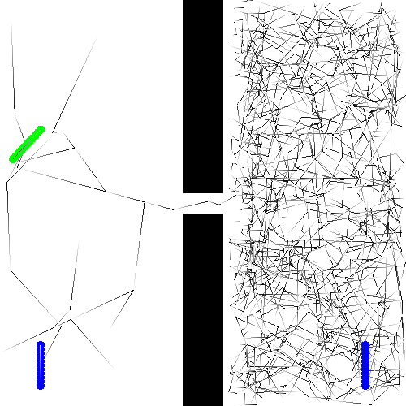

An implementation of RRTs / collision detection in C++. The "robot" is a simple planar stick. Supports polygonal obstacles and animates the final solution.



## Usage

```
make
./a.out
```

If you want to switch between [RRT#](http://dcsl.gatech.edu/papers/icra13.pdf) and RRT, change the constant `PLAIN_RRT` in `rrt.cpp`.

## Dependencies

 * C++11
 * [SFML](https://www.sfml-dev.org/tutorials/2.5/)
